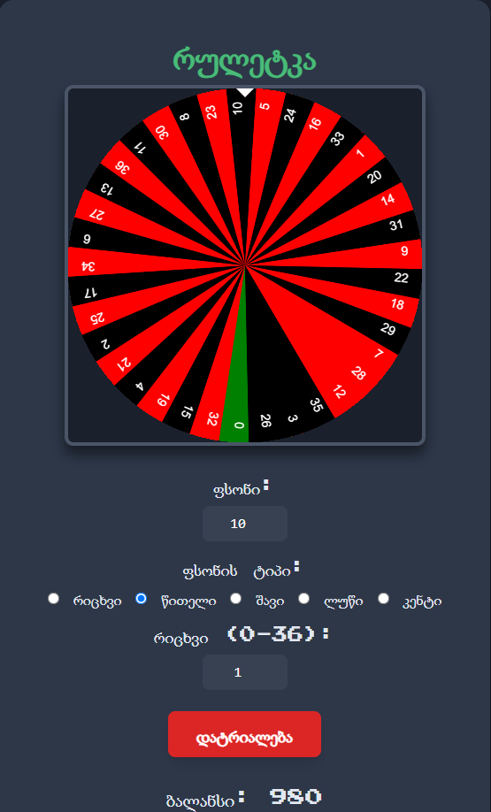

# Roulette Game

A simple browser-based roulette game built with **HTML**, **JavaScript**, **Canvas API**, and **Tailwind CSS**.

The project was one of my first programming experiments and helped me practice interactive UI development, game logic, DOM manipulation, browser storage, and animation with JavaScript.

## Features

- European roulette wheel with numbers **0–36**
- Animated wheel rendered with the HTML5 Canvas API
- Multiple bet types:
  - Exact number
  - Red
  - Black
  - Even
  - Odd
- Configurable bet amount
- Automatic win/loss calculation
- Persistent balance using `localStorage`
- Balance reset option
- Georgian-language interface
- Browser-based responsive layout

## How It Works

The player starts with a balance of **1000** and chooses:

1. A bet amount
2. A bet type
3. A specific number when using the number bet

After pressing the spin button, the roulette wheel animates and stops on a result. The application checks the selected bet and updates the balance automatically.

## Technologies Used

- HTML5
- JavaScript
- Canvas API
- Tailwind CSS
- Browser Local Storage
- GitHub Pages

## Project Structure

```text
Roulette-game/
├── index.html      # Main page and roulette interface
├── roulette.js     # Roulette logic, animation, betting, and balance
├── felix.html      # Experimental browser game page
└── felix.js        # Experimental game logic
```

## Run Locally

Clone the repository:

```bash
git clone https://github.com/SalomeKobakhidze/Roulette-game.git
```

Open the project folder and launch `index.html` in a browser.

No installation or build process is required.

## Live Demo

[Open the GitHub Pages demo](https://salomekobakhidze.github.io/Roulette-game/)

## Screenshot



> Create a `docs` folder in the repository and upload the screenshot as `roulette-screenshot.png`.

## What I Learned

This project helped me understand:

- Working with the Canvas API
- Building animation loops with `requestAnimationFrame`
- Handling user input and form validation
- Creating game state and payout logic
- Saving data in the browser with `localStorage`
- Organizing a small web project for deployment

## Note

This project is an educational browser game and does not use real money.

## Author

**Salome Kobakhidze**

Android & Firebase Developer  
Kotlin · JavaScript · Firebase · Web Applications
